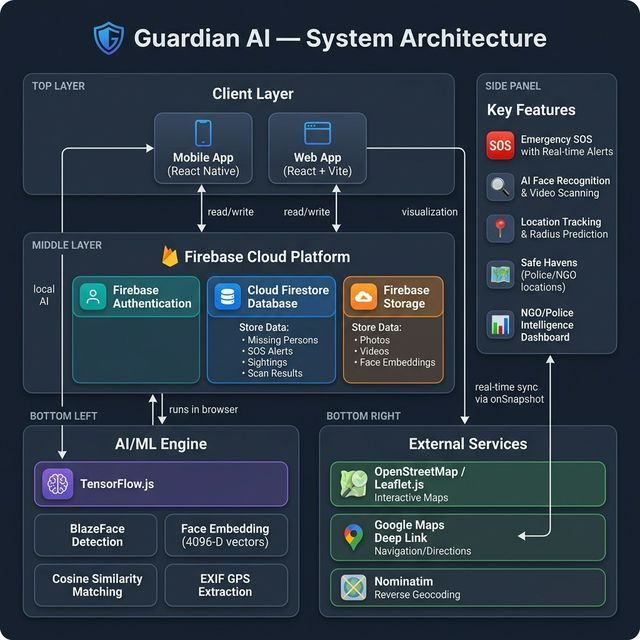

# Guardian AI - Missing Person Intel & Rescue Platform 🛡️🔍

Guardian AI is a specialized intelligence platform designed to help NGOs and law enforcement locate missing persons through advanced AI, facial recognition, and spatial analytics. It bridges the gap between public sightings and actionable intelligence.



## 🚀 Key Features

- **🧠 AI Facial Recognition**: Uses TensorFlow.js to scan photos and videos against a registered database of missing person profiles.
- **📹 Video Intelligence**: Batch process CCTV footage or recorded clips. The system extracts frames and identifies potential matches with precise timestamps.
- **📍 Location Prediction**: Automatically plots confirmed sightings on an interactive map and calculates a "Predicted Area Radius" to prioritize search efforts.
- **📲 Mobile Sync**: Seamlessly integrates with the Guardian AI mobile app for real-time SOS alerts and sighting reports from the public.
- **📊 Intelligence Dashboard**: Dynamic reporting for NGOs to manage cases, track success rates, and coordinate response teams.

## 🛠️ Technology Stack

- **Frontend**: React.js with Vite
- **Styling**: Tailwind CSS / Vanilla CSS
- **Database & Auth**: Firebase (Firestore, Storage, Authentication)
- **AI/ML**: TensorFlow.js (BlazeFace for detection + custom embedding logic)
- **Maps**: Leaflet.js with OpenStreetMap integration

## 📦 Getting Started

### 1. Prerequisites
- Node.js (v16.x or higher)
- A Firebase project

### 2. Installation
```bash
# Clone the repository
git clone https://github.com/your-username/guardian-ai-platform.git

# Install dependencies
npm install
```

### 3. Environment Setup
Create a `.env` file in the root directory and add your Firebase credentials:
```env
VITE_FIREBASE_API_KEY=your_api_key
VITE_FIREBASE_AUTH_DOMAIN=your_auth_domain
VITE_FIREBASE_PROJECT_ID=your_project_id
VITE_FIREBASE_STORAGE_BUCKET=your_storage_bucket
VITE_FIREBASE_MESSAGING_SENDER_ID=your_sender_id
VITE_FIREBASE_APP_ID=your_app_id
```

### 4. Run Development Server
```bash
npm run dev
```

## 🔒 Security Note
Never commit your `.env` file to your public repository. A `.gitignore` has been provided to prevent this.

## 🤝 Contributing
Guardian AI is an open-source initiative. We welcome contributions that help improve facial recognition accuracy, mapping tools, and data coordination.

---
*Developed for Social Impact & Public Safety By SpyderByte.*
